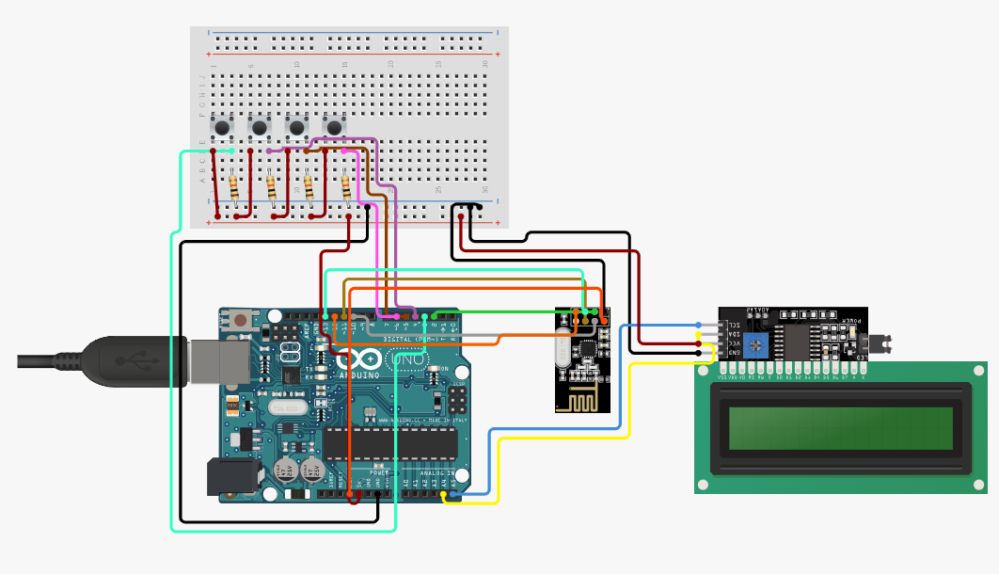

# Morse Code Interpreter

## 📡 Overview

The **Morse Code Interpreter** is a **bidirectional wireless communication system** using **Arduino Uno** boards. It allows users to input Morse code, have it translated to English text, and transmit it wirelessly using the **NRF24L01+ PA LNA** module. The output is displayed in real time on a **16x2 LCD** with I2C support.

🎥 [**Watch the Demo on YouTube**](https://www.youtube.com/watch?v=zYx_dkuq2mQ)

---

## 🧩 Hardware Used (Per Unit)

| Component                 | Description                            |
|--------------------------|----------------------------------------|
| Arduino Uno              | Main microcontroller                   |
| NRF24L01+ PA LNA         | Wireless transceiver module            |
| 16x2 LCD (I2C Interface) | Displays Morse and translated text     |
| 4 x Tactile Push Buttons | Dot, Dash, Action, and Transmit input  |

🔁 Each unit acts as both a **sender** and a **receiver**.

---

## ⚙️ Button Controls

| Button(s)     | Functionality                                                                 |
|---------------|--------------------------------------------------------------------------------|
| Dot           | Adds `.` to current Morse input                                               |
| Dash          | Adds `-` to current Morse input                                               |
| Dot + Dash    | Resets the current input and display                                          |
| Action (tap)  | If Morse input exists: Translates to character If no input: Adds space     |
| Action (hold) | Deletes the last added character                                              |
| Transmit      | Sends the translated message wirelessly                                       |

---

## 📟 How It Works

1. Enter Morse code using the **Dot** and **Dash** buttons.
2. Tap **Action** to translate the input or insert a space.
3. Hold **Action** to delete the last character.
4. Press **Transmit** to send the translated message wirelessly.
5. The receiving unit displays the message on its LCD.

Both units can operate **independently** and act as **sender and receiver**.

---

## 🔧 Libraries Required

Make sure to install the following libraries in the Arduino IDE:

- `LiquidCrystal_I2C`
- `RF24`

Install these using the **Library Manager** under **Sketch > Include Library > Manage Libraries**.

---

## 💾 Code

The full Arduino sketch is included in this repository.

➡️ [**View the Code**](./MorseCodeTransmitter.ino)

---

## 🛠️ Setup Diagram

---

Made with ❤️ using Arduino and wireless magic.
